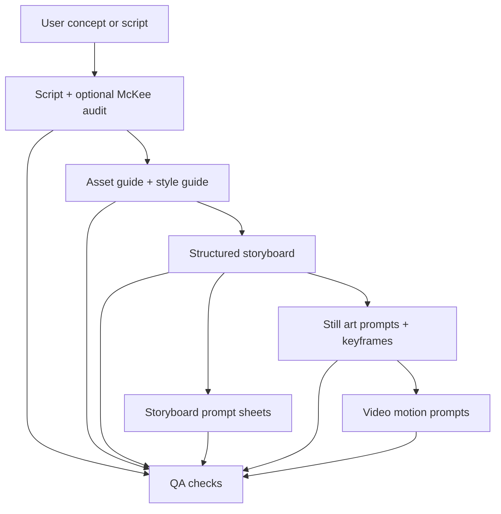

# Codex Project Review

Review date: 2026-05-25

## Current Shape

This repository is a Markdown-first AI video workflow package, not a runnable app. It defines a file-based production pipeline for Codex to move a story concept or script through script/audit, asset and style guides, storyboard, image prompts, art/keyframe prompts, motion prompts, and QA.

The repository is currently workflow-only. The previous test production content has been moved to `archives/`, and `deliverables/` is ready for the next active project.

## Rule Structure

`AGENTS.md` is the active Codex entrypoint.

Codex-standard project directories hold reusable project rules:

- `.codex/agents/<id>.toml`: Codex subagent specifications
- `.agents/skill_registry.md`: replaceable workflow slot registry
- `.agents/skills/<skill>/SKILL.md`: reusable workflow runbooks

The project policy still defaults to local execution in the parent thread. When the user explicitly asks for subagents, parallel agents, delegation, or names a specific subagent, use the matching `.codex/agents/<id>.toml` config.

## Current Workflow

## Current Artifact State

| Area | State |
| --- | --- |
| Production deliverables | Empty, ready for next project |
| Archived test deliverables | Preserved under `archives/<stage>/` |
| Admin files | Present under `deliverables/00_admin/` |
| QA reports | Present under `deliverables/00_admin/qa_reports/` |
| Custom agents | 7 configs under `.codex/agents/<id>.toml` |
| Skill registry | Present under `.agents/skill_registry.md` |
| Repo skills | 22 skills under `.agents/skills/<skill>/SKILL.md` |

## Main Findings

1. The workflow package is now Codex-oriented and project-agnostic.
2. The role and skill layer now uses Codex-standard project directories plus a slot registry for replaceable skill implementations.
3. Guide-stage ownership is now explicit through `guide-director` and `guide-workflow`.
4. The strongest architectural choices are still the same: versioned artifacts, archived history, explicit locks, local reference-image gates, canonical generated-asset folders, and persisted QA reports.
5. The remaining operational gap is tooling portability: helper scripts are PowerShell-first, and this environment does not currently have `pwsh`.

## Recommended Next Step

Keep the Markdown workflow and `.agents/skill_registry.md` as the source of truth. The next useful automation is a portable validator that reports latest versions, missing prerequisites, unresolved QA issues, generated asset manifest status, and registry slot defaults that point to missing or incompatible skills.
