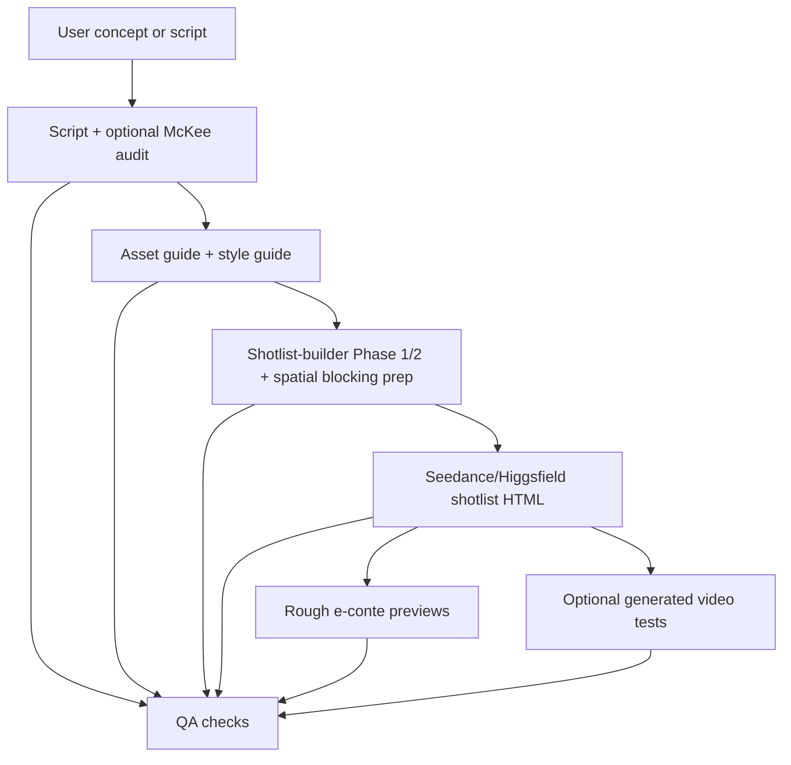

# Codex Project Review

Review date: 2026-05-31

## Current Shape

This repository is a Markdown-first AI video workflow package, not a runnable app. It defines a file-based production pipeline for Codex to move a story concept or script through script/audit, asset and style guides, shotlist breakdown, Seedance/Higgsfield HTML, rough e-conte previews, generated video tests, and QA.

The repository is workflow-only. Generated production assets can exist locally under `deliverables/` for tests or active work and are kept out of Git unless explicitly requested.

## Rule Structure

`AGENTS.md` is the active Codex entrypoint.

Codex-standard project directories hold reusable project rules:

- `.codex/agents/<id>.toml`: Codex subagent specifications
- `.agents/skill_registry.md`: replaceable workflow slot registry
- `.agents/skills/<skill>/SKILL.md`: reusable workflow runbooks

The project policy still defaults to local execution in the parent thread. When the user explicitly asks for subagents, parallel agents, delegation, or names a specific subagent, use the matching `.codex/agents/<id>.toml` config.

## Current Workflow

## Current Artifact State

| Area | State |
| --- | --- |
| Active deliverables | Versioned script/audit and local shotlist production artifacts may exist under `deliverables/` |
| Archived test deliverables | Preserved under `archives/<stage>/` |
| Admin files | Present under `deliverables/00_admin/` |
| QA reports | Present under `deliverables/00_admin/qa_reports/` |
| Custom agents | Active configs under `.codex/agents/<id>.toml` |
| Skill registry | Present under `.agents/skill_registry.md` |
| Repo skills | Active skills under `.agents/skills/<skill>/SKILL.md` |

## Main Findings

1. The workflow package is Codex-oriented and project-agnostic.
2. The role and skill layer uses Codex-standard project directories plus a slot registry for replaceable skill implementations.
3. Guide-stage ownership is explicit through `guide-director` and `guide-workflow`.
4. The active visual production path is now shotlist-first; old standalone board-prompt, art-prompt, and video-prompt stages are retired.
5. Long-task drift is controlled by batch splitting, prompt hard gates inside `sketch-shotlist-workflow`, and independent `qa-workflow` checks.
6. Validation is performed through direct local checks unless a portable helper is added later.

## Recommended Next Step

Keep the Markdown workflow and `.agents/skill_registry.md` as the source of truth. The next useful automation, if needed, is a portable validator that reports latest versions, missing prerequisites, unresolved QA issues, generated asset manifest status, shotlist HTML preview path status, and registry slot defaults that point to missing or incompatible skills.
