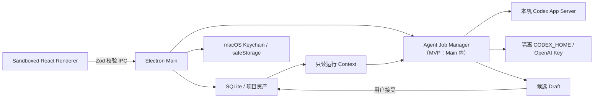

# AI 导演工作台架构

## 进程与信任边界



Renderer 开启 sandbox 和 context isolation，关闭 Node integration。Preload 只暴露
固定方法，所有输入在 Main 再次通过 Zod 校验。项目数据库、文件路径、Codex
账户和已保存 API Key 都不会暴露给网页上下文。
本地参考图由 Main 验证实体归属、真实路径、文件类型和大小后，通过
`aidirector-asset://` 返回；Renderer 只持有 opaque URL。

当前 App Server 本身运行在子进程，但 Job Manager 和协议解析仍在 Main；这是
技术预览与目标架构之间的明确差距，Beta 前迁入 Electron Utility Process。
`readOnly` 只限制写入，不构成项目外文件的读取隔离，所以技术预览只执行审核过的
内置 Skill。用户 Skill 与图片生成保持禁用，直到 OS 沙箱和计费前授权可验证。

## 数据写入顺序

1. 用户或导入器提交明确动作。
2. Storage 在事务内创建实体 Revision。
3. Dependency graph 标记真正受影响的下游实体。
4. Agent 只读取物化 Context，输出带 `baseRevision` 的 Draft Operations。
5. 用户可拒绝、局部接受或全部接受。
6. 接受前创建快照；Schema、Revision 与 Shot/Envelope 不变量全部通过后提交。

Shot Row 和 Prompt Envelope 是独立实体，`ShotEnvelopeLink` 保存有序多对多关系。
重新编组只改 Link，不允许减少或改写 Shot Row。

## 项目目录

```text
project/
  .ai-director/
    project.db
    runs/
    snapshots/
  assets/
    source/
    generated/
  deliverables/
    00_admin/
    10_story/
    20_assets/
    30_shotlist/
```

SQLite 是实时工作状态的唯一事实源。`deliverables/` 只保存用户主动批准并导出的
兼容快照；外部改动不会被静默回写数据库。

Skill 绑定在数据库中保存 ID、版本、内容哈希与可移植定位符，不保存安装机的
绝对 Skill 路径。运行时会在当前安装目录按 ID、版本与哈希重新解析，因此项目包
换机后仍可复现，也不会泄露原机器用户名。运行通道、模型与推理强度以项目数据库
为最终依据；Main 在发起任务前会再次核对 Renderer 请求，避免异步界面状态误用
另一计费来源。
